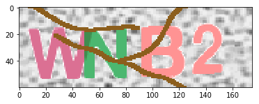
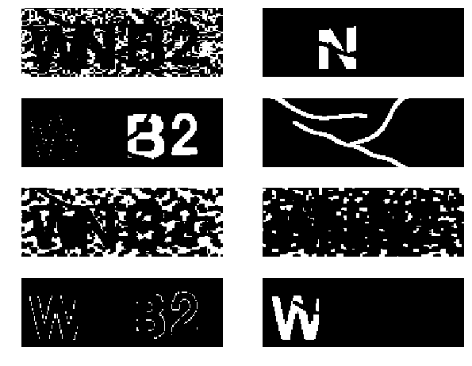
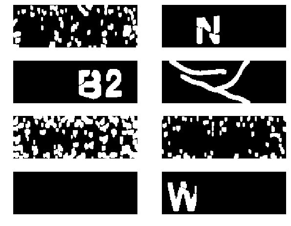
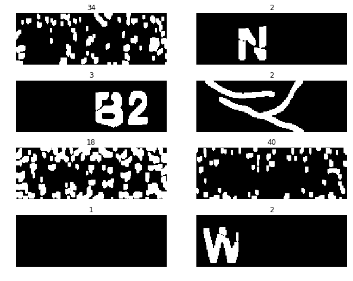
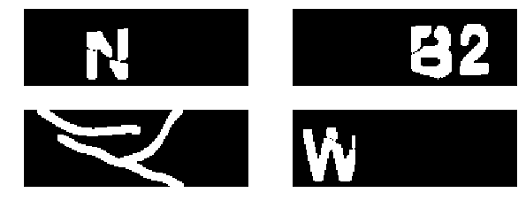
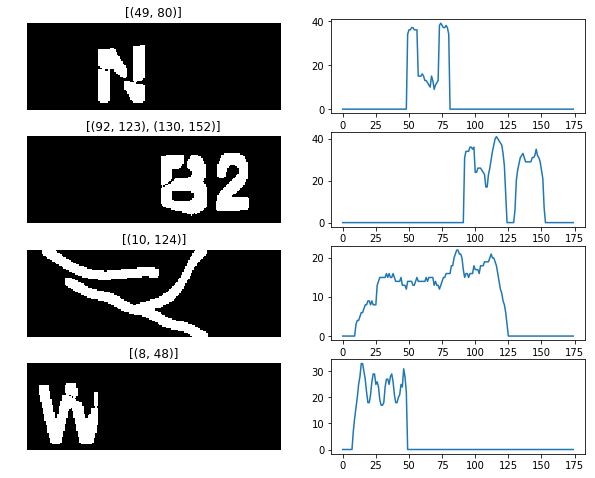
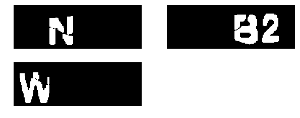
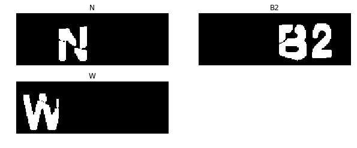
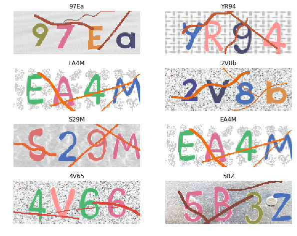

[Результаты тестов](https://www.dropbox.com/sh/dk933atpilyqth3/AAD9dOz575Qa6dyTWsQx9WDKa?dl=0)

```python
%matplotlib inline
from caplib import *
import cv2
```

### Пример работы алгоритма
Основной код вынесен в отдельный модуль `caplib`

Функция `break_captcha` рапознает капчу и возвращает результат в виде строки


```python
(fname,img) = load_random_img(68)
print(break_captcha(img))
show(img)
```

    WNB2




### Разбор алгоритма

Буквы имеют однотонный цвет и выделяются на фоне.

Для отделения букв, фона и цветных полос используем кластеризацию.

Функция `clusterize` выполняет кластеризацию на 8 кластеров по цвету, используя алгоритм `KMeans`.

`simple_bin` приводит изображения к бинарным, так как после кластеризации в изображениях хранится информация о цвете, которая болше не понадобится


```python
clusters = list(map(simple_bin, clusterize(img)))
show_clusters(clusters)

```





Таким образом, мы получили набор изображений, на некоторых из которых содержатся нужные символы, на остальных -- остатки фона и полосы.

Следующим этапом стал выбор характеристих, которые позволили бы из восьми полученных бинарных изображений выбрать те, на которых содержаться символы.

Предварительно к изображениям применялась эрозия и дилатация, чтобы убрать отдельные ненужные пиксели, попавшие в кластер, и залить разрывы на буквах, оставленные полосами.


```python
def morph(img):
    c_erode = cv2.erode(img, cv2.getStructuringElement(cv2.MORPH_ELLIPSE, (3, 3)))
    c_erode = cv2.morphologyEx(c_erode, cv2.MORPH_DILATE,
                               cv2.getStructuringElement(cv2.MORPH_ELLIPSE, (3, 6)))
    return c_erode

morph_clusters = list(map(morph, clusters))
show_clusters(morph_clusters)
```





Далее убираем изображения с большим количесвом связных комонент, так как символ обычно состоит из 2-3 компонент *(разрывы происходят лишь там, где сверху прошла зашумляющая полоса)*.

Ниже приведены изображения и число компонент связности на них:


```python
number_connected_components = lambda img: cv2.connectedComponentsWithStats(morph(img))[0]
show_clusters(morph_clusters, list(map(number_connected_components, morph_clusters)))
```





Оставляем только изображения с числом компонент `1 < c < 10`


```python
stage1_clusters = list(filter(filter_comp_count,morph_clusters))
show_clusters(stage1_clusters)
```





Далее рассмотрим каждый столбец изображения и посчитаем количесвто ненулевых точек в нем.
Таким образом мы получим связность вдоль оси y.

Видно, что буквы имеют определенную ширину в пределах от 10 до 50 пикселей.
Поэтому выбираем только те изображения, где все интервалы подряд идущих ненулевых столбцов имеют заданную ширину.

Результаты `find_cont_subsec` и `get_hist`:




```python
stage2_clusters =  list(filter(non_zero_seq, stage1_clusters))
show_clusters(stage2_clusters)
```





Теперь изображения готовы для распознавания. Используем программу для оптического разпознавания текста `Tesseract`


```python
import pytesseract
from PIL import Image

def recog(img):
    pilimg = Image.fromarray(img)
    conf = '-psm 8 -c tessedit_char_whitelist=abcdefghijklmnopqrstuvwxyzABCDEFGHIJKLMNOPQRSTUVWXYZ1234567890'
    res = pytesseract.image_to_string(pilimg, config=conf)
    return res

show_clusters(stage2_clusters, list(map(recog, stage2_clusters)))
```





Остлось лишь собрать буквы в правльном порядке на основе расстояния до левого края изображения.

Посмотрим примеры удачных и неудачных попыток распознавания:


```python
fig = plt.figure(figsize = (10,8))
for i in range(1,9):    
    (_,img) = load_random_img()
    show(img, break_captcha(img))
```





Итоговая точность данного алгоритма составила 50-60%.

Ошибки происходят как на этапе кластеризации и отбора "хороших" кластеров, так и на этапе распознавания.

Долю ошибок на этапе предобработки можно уменьшить используя более точные критерии отбора кластеров, содержащих символы, или написав специализированный алгоритм кластеризацаии(что, однако, может повлиять на общность и не дать лучшего результата).

Система распознавания дает неверный результат либо в случае сильной изрезанности буквы перекрывающими полосами, либо из-за особенностей шрифта.
